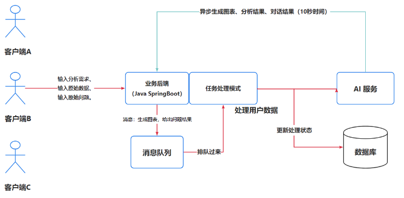

# 本项目是基于讯飞星火的智能数据分析平台。

> AIGC ：Artificial Intelligence Generation Content(AI 生成内容)

区别于传统的BI，数据分析者只需要导入最原始的数据集，输入想要进行分析的目标，就能利用AI自动生成一个符合要求的图表以及分析结论。此外，还会有图表管理、异步生成、AI对话等功能。只需输入分析目标、原始数据和原始问题，利用AI就能一键生成可视化图表、分析结论和问题解答，大幅降低人工数据分析成本。

# 后端技术栈
- Spring Boot 2.7.2
- Spring MVC
- MyBatis + MyBatis Plus 数据访问（开启分页）
- Spring Boot 调试工具和项目处理器
- Spring AOP 切面编程
- Spring Scheduler 定时任务
- Spring 事务注解
- Redis：Redisson限流控制; 缓存图表分析数据，提高查询效率
- MyBatis-Plus 数据库访问结构
- IDEA插件 MyBatisX ： 根据数据库表自动生成
- RabbitMQ：消息队列
- AI SDK：讯飞星火接口开发
- Guava-Retry： 对不合理的AI响应重试
- JDK 线程池及异步化
- Swagger + Knife4j 项目文档
- Easy Excel：表格数据处理、Hutool工具库 、Apache Common Utils、Gson 解析库、Lombok 注解

# 项目特性
- Spring Session Redis 分布式登录
- 全局请求响应拦截器（记录日志）
- 全局异常处理器
- 自定义错误码
- 封装通用响应类
- Swagger + Knife4j 接口文档
- 自定义权限注解 + 全局校验
- 全局跨域处理
- 长整数丢失精度解决

  
- 多环境配置

# 项目架构

# 项目启动
- 下载/拉取本项目到本地
- 通过 IDEA 代码编辑器进行打开项目，等待依赖的下载
- 修改配置文件 chatbi-backend 下 application.yaml 的信息，比如数据库、Redis、RabbitMQ等
- 修改配置文件 xunfei-bigModel下 application.yaml 的信息，讯飞星火的appid等信息
- 修改信息完成后，分别启动chatbi-backend 和 xunfei-bigMode

# 项目核心亮点

- **自动化分析**：通过AI技术，将传统繁琐的数据处理和可视化操作自动化，使得数据分析过程更加高效、快速和准确。
- **一键生成**：只需要导入原始数据集和输入分析目标，系统即可自动生成符合要求的可视化图表和分析结论，无需手动进行复杂的操作和计算。
- **可视化管理**：项目提供了图表管理功能，可以对生成的图表进行整理、保存和分享，方便用户进行后续的分析和展示。
- **异步生成**：项目支持异步生成，即使处理大规模数据集也能保持较低的响应时间，提高用户的使用体验和效率, 使用死信队列，保证当AI服务偶尔出错时，能够重新放回队列继续服务，提高服务稳定性，当超过1min还未成功就放入死信队列。。

